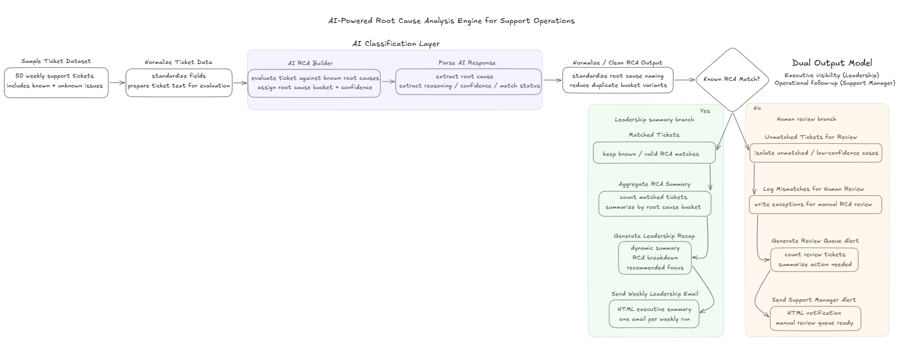
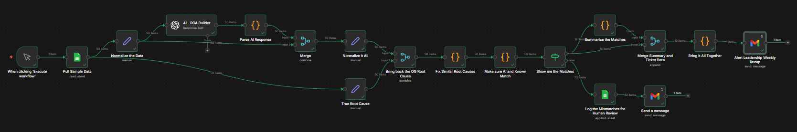
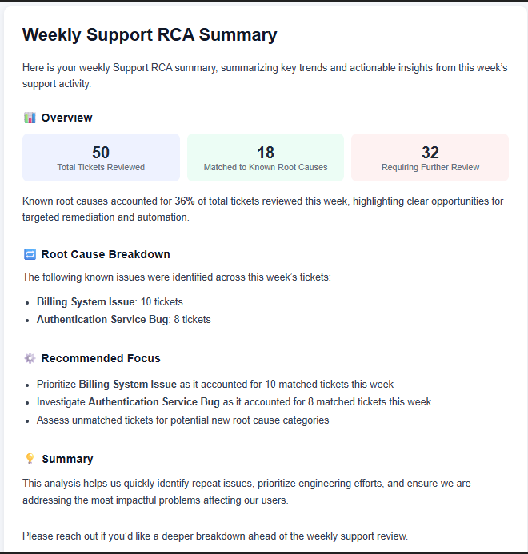
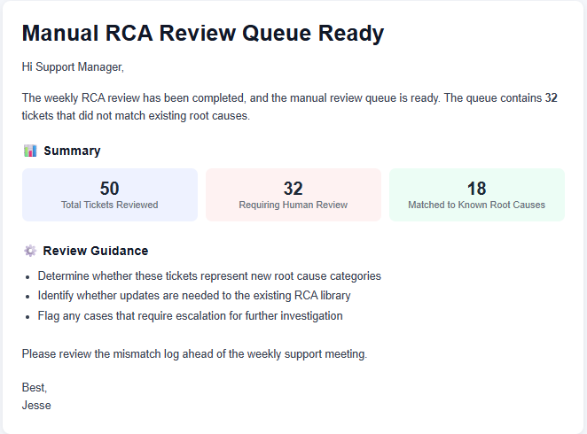

# AI Support RCA Engine

AI-powered Root Cause Analysis (RCA) workflow built with **n8n** and **OpenAI** to identify recurring support issues, surface trends, and enable both executive reporting and human-in-the-loop validation.

---

## Overview

Support teams often struggle to identify **why issues are happening**, not just resolve them. Root cause analysis is typically manual, inconsistent, and difficult to scale across large ticket volumes.

This project introduces an **AI-powered RCA Engine** that classifies support tickets into known root causes, detects repeat issue patterns, and separates unmatched cases for human review.

Rather than relying solely on automation, this system combines **AI classification with human-in-the-loop validation**, ensuring accuracy while continuously improving the RCA library.

This is **Project 6** in a broader system:

- Project 1 → AI Ticket Triage  
- Project 2 → Escalation Risk Detection  
- Project 3 → SLA Breach Prediction  
- Project 4 → Weekly Support Intelligence Report  
- Project 5 → AI Response Suggestion  
- Project 6 → AI Support RCA Engine *(this project)*  

---

## Architecture

This workflow represents the **intelligence layer** of the support system, transforming resolved tickets into structured insights and operational actions.

---

## AI Support Automation Series

This project is part of a multi-stage AI-powered support operations system designed to move teams from reactive workflows to proactive, intelligence-driven operations.

Each project builds on the previous one:

### 🔹 Project 1: AI Ticket Triage  
Classifies incoming support tickets, enriches them with structured metadata, and establishes a clean foundation for downstream automation.  
👉 https://github.com/jesseautomates/ai-support-ticket-triage-automation

---

### 🔹 Project 2: Escalation Risk Detection  
Identifies tickets likely to escalate by analyzing urgency, sentiment, and response patterns, enabling earlier intervention.  
👉 https://github.com/jesseautomates/ai-support-escalation-risk-detection

---

### 🔹 Project 3: SLA Breach Prediction  
Predicts which tickets are at risk of missing SLA before deadlines are breached, allowing teams to prioritize and act proactively.  
👉 https://github.com/jesseautomates/ai-sla-breach-prediction

---

### 🔹 Project 4: Weekly Support Intelligence Report  
Aggregates support metrics and AI signals into a structured weekly report with insights, risks, and recommendations.  
👉 https://github.com/jesseautomates/ai-support-intelligence-report/

---

### 🔹 Project 5: AI Response Suggestion  
Generates intelligent, context-aware response drafts to assist agents in resolving tickets faster and more consistently.  
👉 https://github.com/jesseautomates/ai-support-response-suggestion

---

### 🔹 Project 6: AI Support RCA Engine *(this project)*  
Classifies resolved tickets into root causes, identifies repeat issues, and routes unmatched cases for human review.

---

Together, these projects form a layered AI pipeline:

**Triage → Risk Detection → SLA Prediction → Intelligence Reporting → Agent Assistance → Root Cause Analysis**

This progression demonstrates how AI can be applied across the full support lifecycle.

---

## What this workflow does

- Analyzes resolved support tickets to determine root causes  
- Classifies tickets into known RCA categories using AI  
- Standardizes and normalizes root cause outputs  
- Separates known vs unknown issues  
- Aggregates RCA trends for reporting  
- Generates a weekly executive summary  
- Routes unmatched tickets for human review  
- Enables continuous improvement of the RCA library  

---

## How it works

### 1. Ticket Intake & Normalization
- Processes a dataset of resolved support tickets  
- Standardizes ticket structure and prepares text for evaluation  

---

### 2. AI RCA Classification
- Evaluates each ticket against known root causes  
- Assigns:
  - Root cause category  
  - Confidence level  
  - Supporting reasoning  

---

### 3. Response Parsing & Normalization
- Extracts structured AI outputs  
- Standardizes root cause naming  
- Reduces duplicate or inconsistent categories  

---

### 4. Validation Layer
- Compares AI classification against approved RCA library  
- Determines:
  - Known match  
  - Unmatched / low-confidence case  

---

### 5. Decision Layer (Core System Split)
This is the key system design element:

- **Matched tickets → Leadership reporting pipeline**
- **Unmatched tickets → Human review pipeline**

---

### 6. Leadership Reporting (Executive Visibility)
- Aggregates matched tickets by root cause  
- Generates:
  - RCA breakdown  
  - Key insights  
  - Recommended actions  
- Sends **weekly HTML summary email** to leadership  

---

### 7. Human Review Queue (Operational Follow-Up)
- Logs unmatched tickets for manual review  
- Generates a review queue summary  
- Sends **alert to support manager** for investigation  
- Enables:
  - New root cause discovery  
  - RCA library improvement  

---

## Example Output

### Weekly RCA Summary

- Total Tickets Reviewed: 50  
- Tickets Matched to Known Root Causes: 19  
- Tickets Requiring Review: 31  

Key insight:
- Known root causes accounted for ~38% of tickets, highlighting opportunities for targeted remediation  

---

### Manual Review Alert

- 31 tickets flagged for human review  
- Did not match existing RCA categories  
- Requires classification, escalation, or RCA updates  

---

## Screenshots

### Architecture Diagram

### Leadership Email Output

### Support Manager Alert

### Sample Ticket Dataset
Use Sample Tickets - RCA Build - Sample Tickets CSV in Repo

---

## Tech Stack

- **n8n** (workflow orchestration)  
- **OpenAI API** (classification + reasoning)  
- Optional integrations:
  - Help desk platforms (Zendesk, ServiceNow, etc.)  
  - Slack / internal tools  
  - Data storage / logging systems  

---

## Setup

1. Import the workflow JSON into n8n  
2. Add API credentials (OpenAI, etc.)  
3. Load sample ticket dataset (CSV or API source)  
4. Define known RCA categories  
5. Configure classification prompts  
6. Set up email nodes for:
   - Leadership summary  
   - Support manager alerts  
7. Test workflow with sample tickets  
8. Tune prompts and RCA categories over time  

---

## Key Takeaways

- Demonstrates **AI-powered root cause analysis at scale**  
- Combines automation with **human-in-the-loop validation**  
- Enables **proactive issue identification and trend detection**  
- Separates outputs for **different stakeholders (exec vs ops)**  
- Provides a foundation for continuous improvement in support systems  
